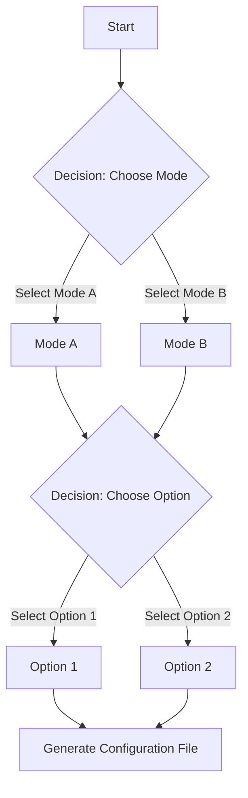

# Decision Logic Tree

Below is the graphical diagram representing the decision logic tree for configuration selection:

## Steps Overview

1. Initialize the configuration (Start).
2. Choose between different modes (Mode A or Mode B).
3. Based on the mode, make an additional choice (Option 1 or Option 2).
4. After the decisions, generate and export the configuration file.
